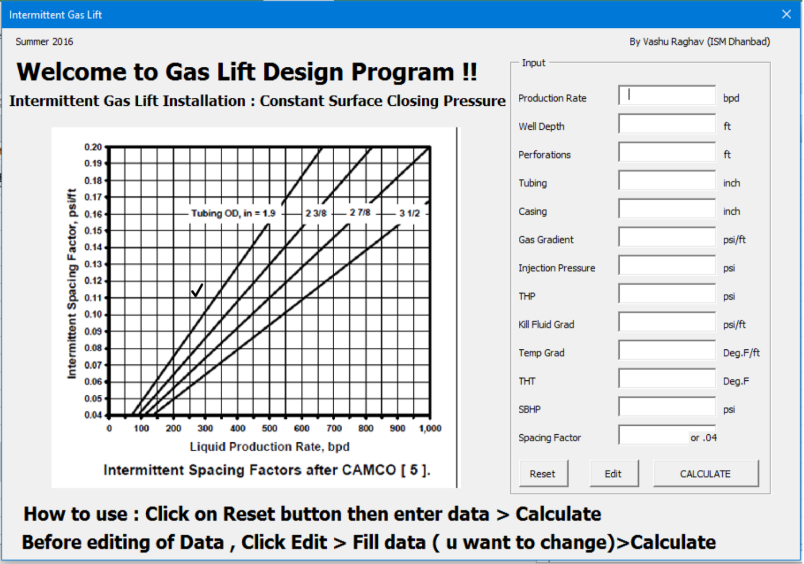
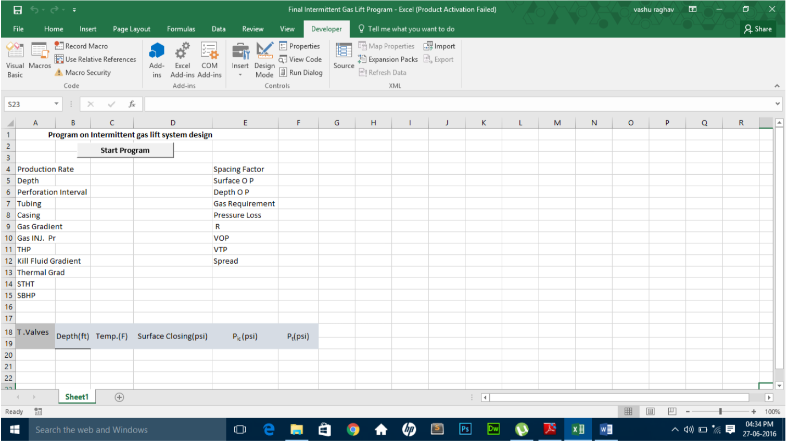
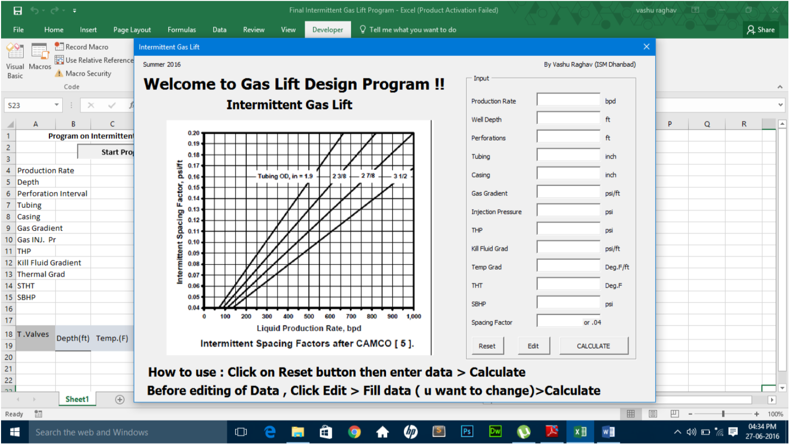
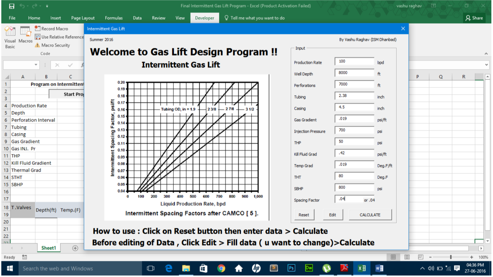
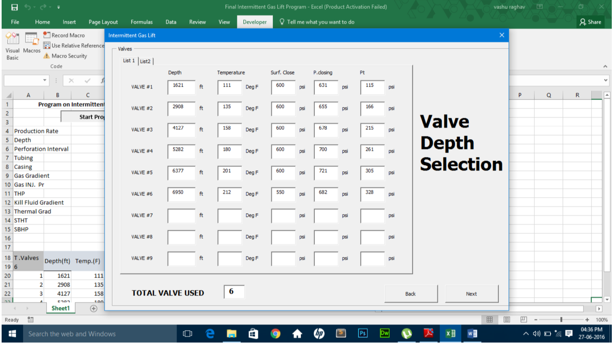
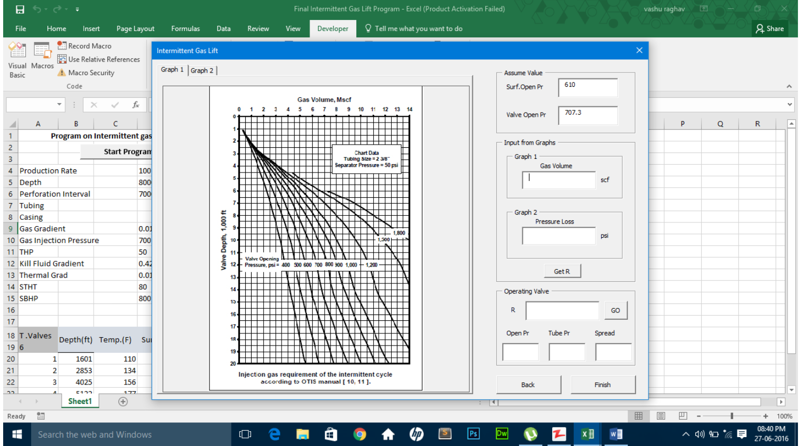
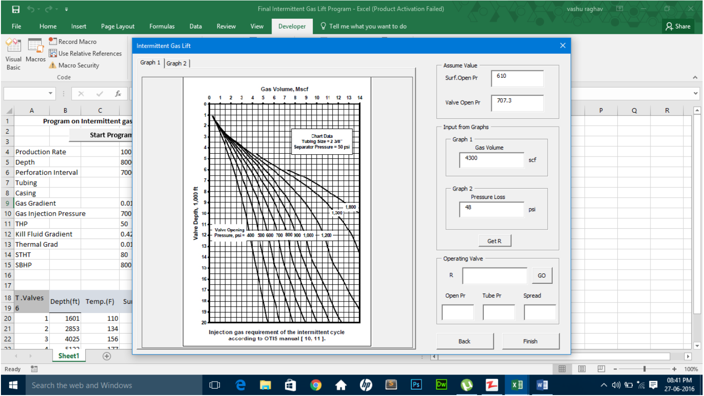
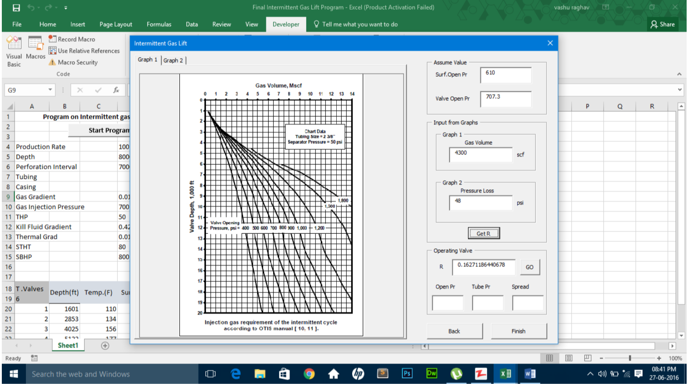
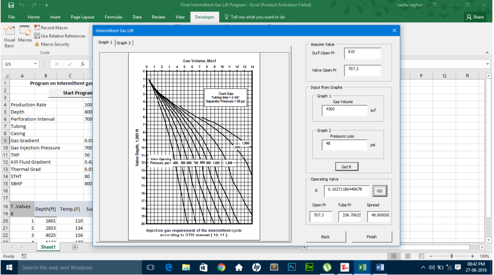
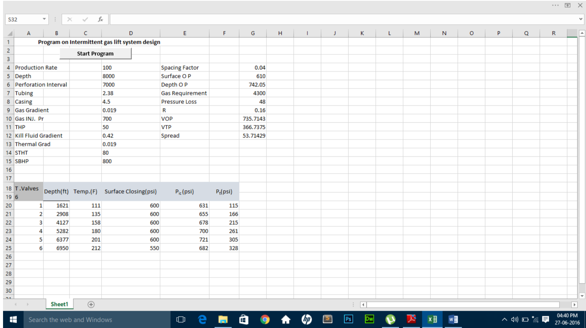

This was my research project during my summer internship at Institute of Oil & Gas Production Technology(IOGPT), Mumbai under the mentorship of Mr. T.K. Mandal, DGM(P), Artifical Lift Department.

This software is made in Virtual Basic Application (VBA) of Microsoft Excel 2016. It is used to design intermittent gas lift installation system, based on Constant Surface Closing Pressure procedure. A common design procedure for installations with single-point gas injection uses a constant surface closing pressure for all valves in the unloading valve string.

 

## Application Demo

  Open the program in MS Excel.
  
   
    
  Click on “Start Program” button to run the program.
  
  Welcome to Intermittent Gas Lift window will appear.

   
   
  Click on “Reset” button (just to make sure everything is cleaned up) and then fill up all the column with the desired data.</li>
  
   

  Click on “Calculate” button and a window named Valve Depth Selection will appear.
  
   

  Click on “Next” and an Operating Valve Window will appear.
  
   

  Fill up the Gas Volume and Pressure Loss column from Graph1 & Graph2 respectively and then Click “Get R” button.
  
   

  R value will be shown in Operating valve frame.
    
   
 
  If you have R near by the calculated R in operating valve frame, then input that value and click “GO” button.
    
   

  Hence the opening pressure , tubing pressure and spread will be appear in their respective column.
  
  If the spread is near by to Pressure Loss then your reading are correct, but if it is different then change the Surf. Open Pr. by 10 psi in assume value frame and Repeat from Step 7.

  Click “Finish” button the program.
  
   

  An excel sheet of the data will appear and print out the results.
   
   

Source: <a href="https://github.com/vashuraghav/Gas-Lift-System-Design-Tool"><i class="large github icon"></i>Gas Lift Report</a>
